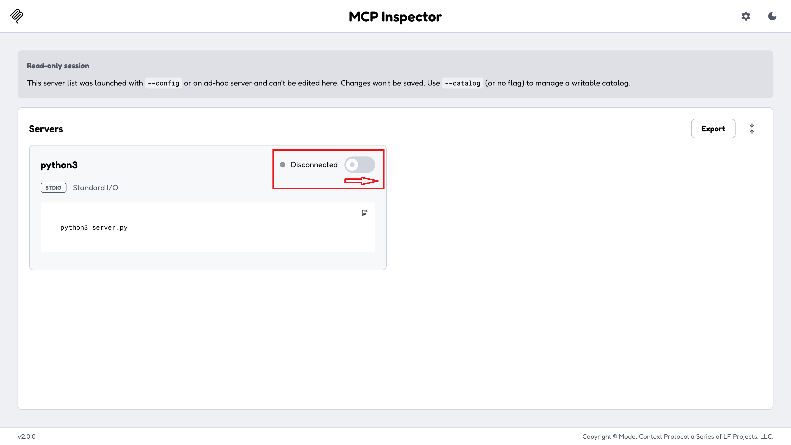
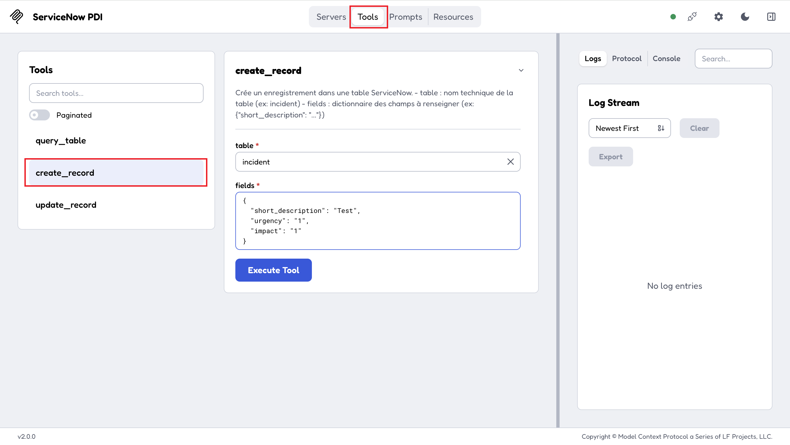
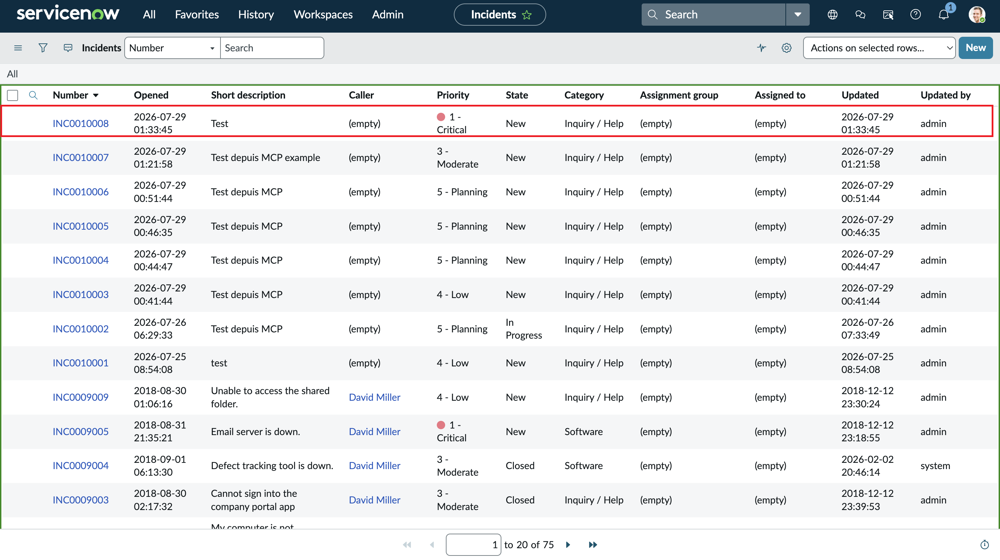
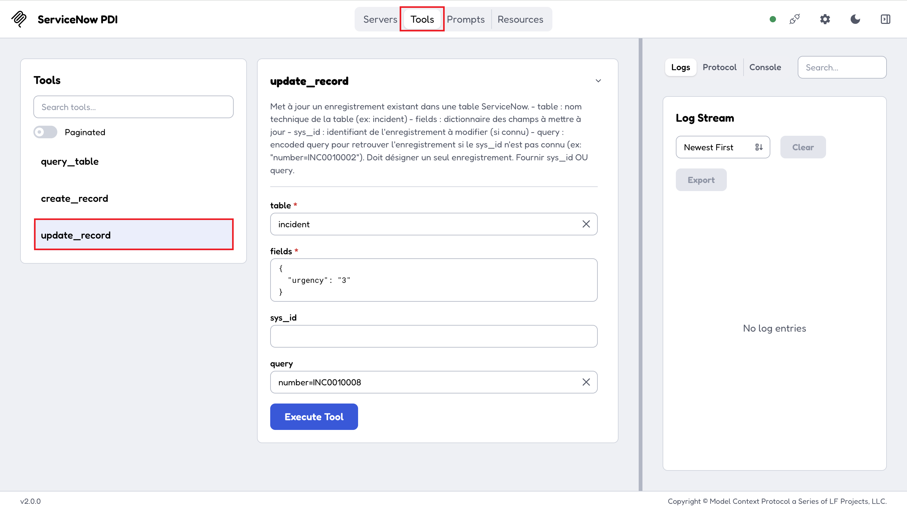
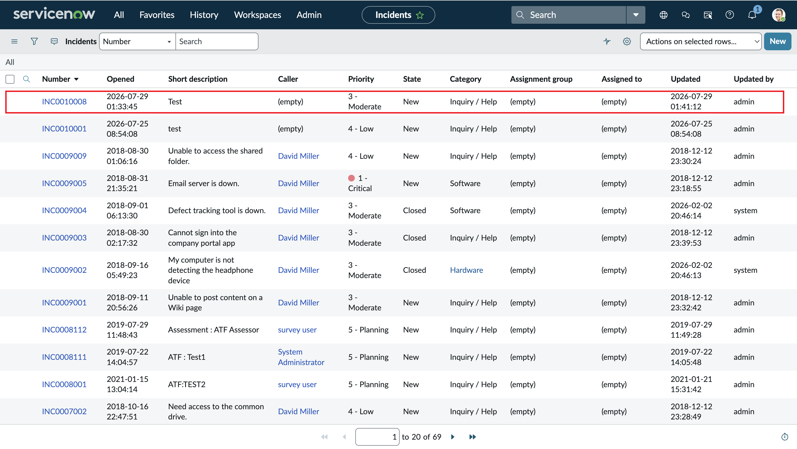

# Serveur MCP ServiceNow PDI

Ce serveur permet à Claude d'interroger et de modifier des données sur une PDI ServiceNow (lire des incidents, créer un enregistrement, etc.).

## Installation

```bash
python3 -m venv venv
source venv/bin/activate
pip install -r requirements.txt
```

## Configuration

Renseigner dans le fichier `.env` :

```
SERVICENOW_INSTANCE_URL=https://instance.service-now.com
SERVICENOW_USER=admin
SERVICENOW_PASSWORD=mot-de-passe
```

## Lancer le serveur

```bash
source venv/bin/activate
python3 server.py
```

Le serveur démarre et attend qu'un client MCP (Claude Code, Claude Desktop) s'y connecte.

## Tester

```bash
source venv/bin/activate
npx @modelcontextprotocol/inspector python3 server.py
```

Le navigateur s'ouvre automatiquement sur l'interface de l'Inspector. Cliquez sur **Connect**.

 


Avant de relancer cette commande (par exemple après une modification de `server.py`), arrêter d'abord l'instance précédente avec `Ctrl+C` dans son terminal — sinon la nouvelle instance ne peut pas démarrer et le navigateur continue d'afficher l'ancien code.


## Tools disponibles

- `query_table` : lit des enregistrements (`table`, `query`, `fields`, `limit`, `offset`, `display_value`)
  Exemple : `table = incident`, `query = active=true^priority=1`, `limit = 5`

- `create_record` : crée un enregistrement (`table`, `fields`)
   Exemple : `table = incident`, `fields = {"short_description": "Test depuis MCP", "urgency": "2"}`

  <p align="left">
     
     
  </p>

- `update_record` : modifie un enregistrement (`table`, `fields`, et `sys_id` OU `query`)
  Exemple avec sys_id : `table = incident`, `sys_id = <sys_id de l'incident>`, `fields = {"urgency": "3"}`
  Exemple avec query : `table = incident`, `query = number=INC0010002`, `fields = {"urgency": "1"}`

  

  Voici le résultat attendu :
  
  

  Pas besoin de connaître le `sys_id` : `query` permet de retrouver l'enregistrement (ex: par son numéro affiché). La requête doit désigner un seul enregistrement, sinon le tool renvoie une erreur.

`fields` doit être un objet JSON, pas du texte. Dans l'Inspector, basculer l'input de ce paramètre en mode JSON (bouton/toggle `{ }` à côté du champ) avant de coller la valeur.


## En cas de problème

- **`MCP error -32602: Invalid request parameters`** : un paramètre ne correspond pas au type attendu. Le cas le plus fréquent est `fields` envoyé comme du texte brut au lieu d'un objet JSON — vérifier que l'input est bien en mode JSON dans l'Inspector.

- **`Proxy Server PORT IS IN USE at port 6277`** : une instance de l'Inspector tourne déjà. Arrêter le processus précédent (`Ctrl+C` dans son terminal) avant de relancer la commande.
